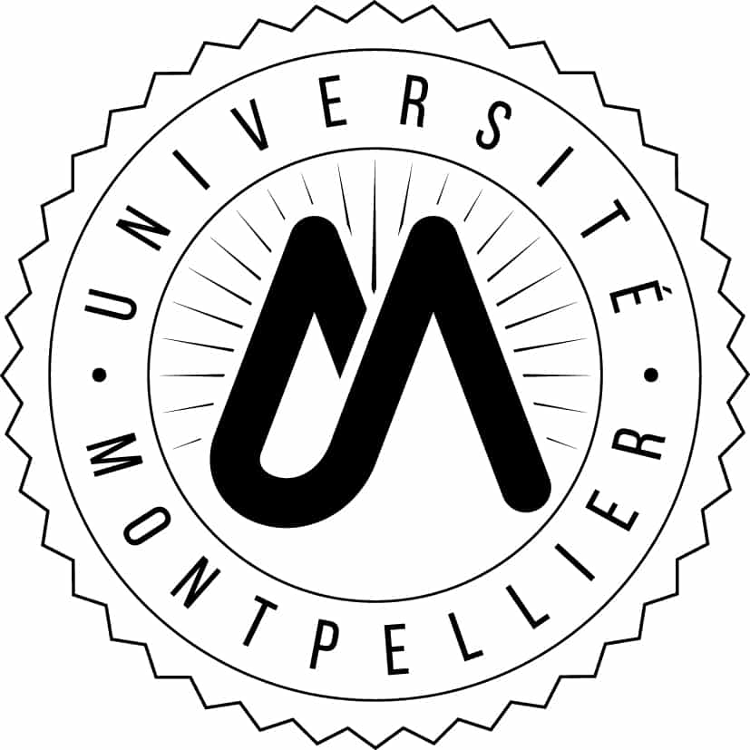

# CC-FIM
#  IMAGINA - Frequent Itemset Mining - CC - 
### Université de Montpellier – Département Informatique
* **Cours:** [HMIN233](https://formations.umontpellier.fr/fr/formations/sciences-technologies-sante-STS/master-XB/master-informatique-program-fruai0342321nprme154/informatique-pour-les-sciences-ips-subprogram-pr480/algorithmes-d-exploration-et-de-mouvement-HMIN233/algorithmes-d-exploration-HMIN233A.html)
* **Enseignant:** [Nadjib Lazaar](mailto:nadjib.lazaar@umontpellier.fr)

**Cliquez sur le lien ci-dessous pour faire votre fork privé du TD :**
https://classroom.github.com/a/qkx5m07Y

### Date limite de rendu: 14/02/2021 23h00

# Equipe :
* Etudiant 1 : (Nom, Prenom, Mail)
* Etudiant 2 :
* Etudiant 3 :
* Etudiant 4 :
* Etudiant 5 :
* Etudiant 6 :

